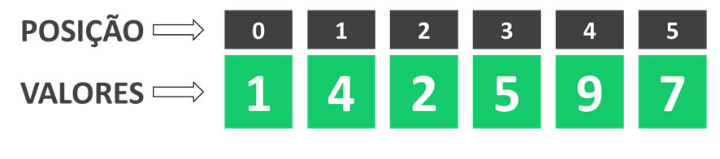

# Leetcode - Problem 1: Explicando soluções

Se tem uma coisa que eu sempre gostei foi resolver esses problemas de lógica o que eu mais achava interessante era que
muitas vezes existia mais de uma caminho possível para chegar na respostas certa ou então tinha alguma sacada simples
que facilitava muito o processo de na solução.

Faz mais ou menos uns 2 meses que comecei a estudar programação de mais intensamente e uma das coisas que eu mais gosto
de fazer é resolver desafios e problemas de lógica de programação e algoritimos, tanto que de tempo em tempos estou
fazendo lives com meu amigo Bino no nosso canal [“Estudando Programação na Prática”](ADD LINK DO CANAL) resolvendo
alguns desses problemas.

A ideia desse post é compartilhar com vocês a solução de problema que vi no [leetcode](ADD LINK LEETCODE) se você também
gosta de programação e de resolver esse tipo de exercício para praticar não esquece de comentar no fim me falando o que
achou da solução e como você resolveria!

## Resolvendo o TwoSum

Vamos começar do início, o problema se chama [TwoSum](ADD LINK DO PROBLEMA ORIGINAL) ou em uma tradução livre
DoisSomados e o enunciado do problema é basicamente o seguinte:
Você vai receber uma lista de números e um número alvo e seu objetivo é encontrar quais números da lista que somados são
iguais ao número alvo, exemplo:
```
lista = [1, 4, 2, 5, 9, 7]
numero_alvo = 9
```
Para esse exemplo olhando a lista e o número alvo podemos ver que:

4 + 5 = 9

Logo a resposta nesse exemplo seria a posição dos números 4 e 5 na lista, ou seja [1,3], como podemos ver na
imagem abaixo:


