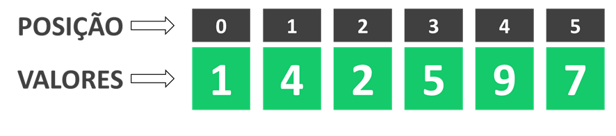

# Leetcode - Problem 1: Explicando soluções

Se tem uma coisa que eu sempre gostei foi resolver esses problemas de lógica o que acho mais interessante é que muitas
vezes existe mais de uma caminho possível para chegar na respostas certa ou então tem alguma sacada simples que
facilita muito o processo de solução.

Há aproximadamente 2 meses que comecei a estudar programação de mais intensamente e uma das coisas que eu mais gosto
de fazer é resolver desafios e problemas de lógica de programação e algoritimos, tanto que de tempo em tempos estou
fazendo lives com meu amigo Bino no nosso canal [“Estudando Programação na Prática”](ADD LINK DO CANAL) resolvendo
alguns desses problemas.

A ideia desse post é compartilhar com vocês a solução de problema que vi no [leetcode](ADD LINK LEETCODE) se você também
gosta de programação e de resolver esse tipo de exercício para praticar não esquece de comentar no fim me falando o que
achou da solução e como você resolveria!

## Resolvendo o TwoSum

Vamos começar do início, o problema se chama [TwoSum](ADD LINK DO PROBLEMA ORIGINAL) ou em uma tradução livre
DoisSomados e o enunciado do problema é basicamente o seguinte:
Você vai receber uma lista de números e um número alvo e seu objetivo é encontrar quais números da lista que somados são
iguais ao número alvo, exemplo:

```python
lista = [1, 4, 2, 5, 9, 7]
numero_alvo = 9
```

Para esse exemplo olhando a lista e o número alvo podemos ver que:

4 + 5 = 9

Logo a resposta nesse exemplo seria a posição dos números 4 e 5 na lista, ou seja [1,3], como podemos ver na imagem
abaixo:



Agora que já entendemos como nosso algoritmo deve funcionar vamos pensar na implementação. Esse exercício é bem simples
para resolver mentalmente uma vez que entendemos a dinâmica, o desafio real está em como implementar isso através de um
algoritmo que seja rápido mesmo para grande volume de dados. Minha ideia inicial foi utilizar uma lógica que usei para
resolver ou outro problema (esse aqui) que é a seguinte:
1º Vamos organizar a lista em ordem crescente, ou seja, do menor valor para o maior valor:

```python
lista_original = [1, 4, 2, 5, 9, 7]
lista_ordenada = [1, 2, 4, 5, 7, 9]
```

2º Vamos fazer a soma dos extremos da lista, ou seja, vamos somar o maior e o menor valor:

```python
menor_valor = 1
maior_valor = 9
soma_extremos = menor_valor + maior_valor  # soma_extremos = 1 + 9 => soma_extremos = 10
```

3º Vamos comparar a soma dos extremos com o nosso número alvo:

```python
soma_extremos = 10
numero_alvo = 9
```

Analisando os dois valores podemos ver que a soma dos extremos é maior que o número alvo, ou seja, o maior e o menor
número da nossa lista somados são maiores que nosso valor alvo.

Com isso podemos concluir que o maior número da nossa lista, no exemplo 9, é grande demais para o número alvo, afinal se
mesmo somado com o menor número da lista, no caso o 1, o resultado é maior que o o número alvo então não compensa nem
verificar quanto vai dar a soma desse número maior com os outros. Só para tentar deixar mais claro, usando essa lógica
não precisamos comparar o 9 com todos os números, só precisamos comprar ele com o número 1 que é o menor da lista e isso
vai nos dar muito mais velocidade na resolução do problema!!

Talvez se você já programa a um tempo e está acostumado com esse tipo de solução pode achar essa lógica bem simples e
talvez já até tenha uma lógica melhor, mas eu fiquei super feliz quando consegui chegar nessa lógica!!!

Vou continuar a lógica para fechar o raciocínio antes de partir para o código.

4º Defina um novo maior_valor ou menor_valor de acordo com a comparação da soma_extremos com o numero_alvo:

- Se a soma_extremos for maior que número alvo: Exclua o maior número da lista e repita o passo 2
- Se a soma_extremos for menor que o número alvo: Exclua o menor número da lista e repita o passo 2 Faça essa processo
  até encontrar o número alvo ou até que só exista um único número na lista Então resumindo nosso algoritmo:

1. Ordenar a lista
2. Somar extremos da lista
3. Comparar soma com número alvo
4. Redefinir a lista
5. Voltar para o passo 2 (até encontrar o valor alvo ou só sobrar apenas um elemento na lista)
   Vamos colocar em prática com nosso exemplo para deixar mais claro:

Se o exercício pedisse para encontrar quais números da lista que somados resultam no número alvo nosso algoritmo estaria
pronto, mas ele pede para encontrar a posição desses números na lista, e foi esse ponto que deixou esse exercício um
pouco mais difícil para mim. Novamente, olhando a lista inicial na imagem abaixo é fácil ver que a posição dos números é
2 e 5


O problema é como fazer o programa encontrar essa resposta. Minha primeira ideia foi a seguinte, eu peço para o script
retornar a posição dos números encontrados na lista original, em códico python ficaria assim:

```python
return [lista_original.index(2), lista_original.index(7)]
```

O que resultaria em: [2, 5], que é a resposta correta, o problema é que em alguns casos essa tática não funciona, pois
como o método .index() do python procura o elemento da esquerda para a direta e retorna a posição que ele encontra se a
lista original tiver dois elementos repetidos que somados resultam no numero objetivo eu encontraria uma resposta
errada. Imagine por exemplo que:

```python
Lista = [0, 5, 3, 2, 8, 3, 9]
Numero
objetivo = 6  # No exemplo acima nosso script encontraria que 3 + 3 = 6 ou seja ele retornaria o seguinte:

return [lista_original.index(3), lista_original.index(3)]
# O que resultaria em: [2, 2], que é a resposta errada, a correta seria [2, 5].
```

Para resolver esse problema eu fiz uma pequena mudança no algoritmo que vou explicar para vocês analisando o código da
minha resposta final:

```python
def TwoSum(lista, valor_alvo):
    lista = [(posicao, numero) for posicao, numero in enumerate(lista)]
    lista_ordenada = sorted(lista, key=lambda x: x[1])
    while len(lista) >= 2:
        maior_valor = lista_ordenada[-1][1]
        menor_valor = lista_ordenada[0][1]
        soma_extremos = maior_valor + menor_valor

        if soma_extremos > valor_alvo:
            del lista_ordenada[-1]

        elif soma_extremos < valor_alvo:
            del lista_ordenada[0]

        else:
            return [lista_ordenada[0][0], lista_ordenada[-1][0]]
```

Analisando linha a linha o que temos é o seguinte:
<details>
<summary> Linha 2: Criando lista com os índices

```python
lista = [(posicao, numero) for posicao, numero in enumerate(lista)]
```

</summary>

Essa primeira linha criamos uma lista que salva cada um dos números da lista inicial e suas respectivas posições. Por
exemplo se fizermos o teste com a lista = [0,5,3,2,8,3,9] e o valor_alvo = 6 essa primeira linha nos daria o seguinte
resultado:

```python
lista = [(0, 0), (1, 5), (2, 3), (3, 2), (4, 8), (5, 3), (6, 9)]
```

</details>

<details>
<summary> Linha 3: Ordenando a lista

```python
lista_ordenada = sorted(lista, key=lambda x: x[1])
```

</summary>
Aqui ordenamos nossa lista considerando os valores da lista original, ou seja, antes da ordenação tinhamos:
`lista = [(0, 0), (1, 5), (2, 3), (3, 2), (4, 8), (5, 3), (6, 9)]`

Depois da ordenação ficamos com o seguinte resultado:
`lista_ordenada = [(0, 0), (3, 2), (2, 3), (5, 3), (1, 5), (4, 8), (6, 9)]`

</details>

<details>
<summary> Linha 4: Criando um loop 

```python
while len(lista) >= 2
```

</summary>
Aqui definimos um loop que vai acontecer enquanto houver mais que dois elementos na lista, a ideia é que a cada iteração
vamos excluir um elemento da lista, até que no final vamos ficar com uma das duas possibilidades:
1. Vamos encontrar uma soma de valores que resulta no valor procurado
2. Não vamos encontrar essa soma e vamos sair do loop
</details>

<details>
<summary> Linha X a Y: Definindo extremos da lista

```python
maior_valor = lista_ordenada[-1][1]
menor_valor = lista_ordenada[0][1]
soma_extremos = maior_valor + menor_valor
```

</summary>
Aqui definimos um loop que vai acontecer enquanto houver mais que dois elementos na lista, a ideia é que a cada iteração
vamos excluir um elemento da lista, até que no final vamos ficar com uma das duas possibilidades:
1. Vamos encontrar uma soma de valores que resulta no valor procurado
2. Não vamos encontrar essa soma e vamos sair do loop
</details>

<details>
<summary> Linha X a Y: Caso 01 - soma dos extremos MAIOR que valor alvo

```python
        if soma_extremos > valor_alvo:
    del lista_ordenada[-1]
```

</summary>
Caso a soma dos extremos da lista ordenada seja maior que o valor alvo, nos excluimos o último elemento da lista,
afinal se mesmo somado com o menor elemento da lista o resultado é maior que o valor alvo nem compensa analisar quanto 
vai dar a soma desse valor maior com os outros elementos da lista.
</details>

<details>
<summary> Linha X a Y: Caso 02 - soma dos extremos MENOR que valor alvo

```python
        elif soma_extremos < valor_alvo:
del lista_ordenada[0]
```

</summary>
Caso a soma dos extremos da lista ordenada seja menor que o valor alvo, nos excluimos o primeiro elemento da lista, a 
lógica aqui é a mesma que usamos no caso anterior, se o menor elemento da lista somado com o maior elemento da lista 
ainda assim resulta em um número menor que o valor alvo não compensa analisar esse menor elemento somado com nenhum dos 
outros elementos da lista. 
</details>

<details>
<summary> Linha X a Y: Caso 03 - soma dos extremos é igual ao valor alvo

```python
        else:
return [lista_ordenada[0][0], lista_ordenada[-1][0]]
```

</summary>
Por fim, caso a soma dos extremos não seja nem maior, nem menor que o valor alvo podemos concluir que a soma é igual ao
valor alvo, ou seja, chegamos na nossa resposta, nesse caso a função retorna o índice dos dois números que estão nos
extremos, que salvamos lá na linha 2 do código.
</details>


Caso nenhum dos números da lista somados resultem no valor alvo a função não vai retornar nada.

Essa foi a solução que pensei para esse desafio, a ideia desse texto não é mostrar qual a melhor solução para o desafio
mas compartilhar com vocês essa lógica que usei para a solução, se você pensou em algo diferente ou ficou com dúvida em
algum ponto, fique a vontade para comentar!

Obrigado para você que leu até aqui e até o próximo texto =D 


